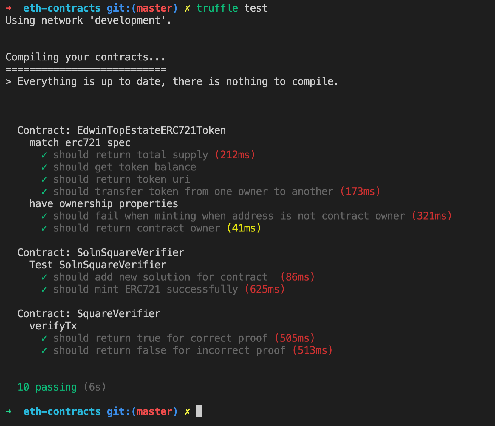

# Real Estate NFT

This project demonstrates the use of the ERC721 standard to create an NFT collection which is deployed to Rinkeby and listed on opensea testnet.


## Development

Firstly run  `npm i` to install all the dependenicies used in this project which are specified in the package.json file.

### Testing
Js unit tests for the solidity contract was used. To run tests, go to your terminal and run :

```
cd eth-contracts
``` 
next run : 
```
truffle test 
```

you should be greated with a printout like below


### Compile Zokrates
```
docker run -v /Users/eo/workspace/Blockchain-Capstone/zokrates/code/square:/home/zokrates/code -it zokrates/zokrates:0.4.6 /bin/bash
```
once inside the docker container shell, run 
```
  ~/zokrates compile -i square.code && \
  ~/zokrates setup && \
  ~/zokrates compute-witness -a 3 9 && \
  ~/zokrates generate-proof && \
  ~/zokrates export-verifier

```

## Deployed contract 

### Ether scan SolnSquareVerifier address
https://rinkeby.etherscan.io/address/0xb128081e5e05bd793b954c3b92089d6b8c77c2c5

10 tokens Minted using MEW https://www.myetherwallet.com/wallet/interact

### Open sea Collection
https://testnets.opensea.io/collection/edwintop-realestate


# Project Resources

* [Remix - Solidity IDE](https://remix.ethereum.org/)
* [Visual Studio Code](https://code.visualstudio.com/)
* [Truffle Framework](https://truffleframework.com/)
* [Ganache - One Click Blockchain](https://truffleframework.com/ganache)
* [Open Zeppelin ](https://openzeppelin.org/)
* [Interactive zero knowledge 3-colorability demonstration](http://web.mit.edu/~ezyang/Public/graph/svg.html)
* [Docker](https://docs.docker.com/install/)
* [ZoKrates](https://github.com/Zokrates/ZoKrates)
